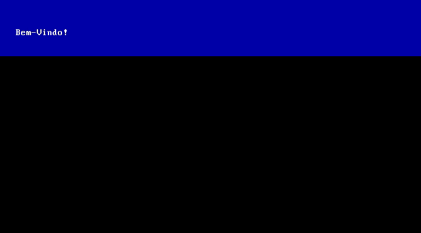

# ❔ How to Build an Operating System

## ✨ What you need to get started

- 📝 Text editor
- 💻 Virtual machine
- 💿 [Rufus](https://rufus.ie/downloads/) - Recommended rufus-2.18
- 🔧 Binary compiler - [Nasm](https://www.nasm.us/)
- 💾 Data image file - [Fergoraw](https://www.fergonez.net/softwares/fraw)
- 📀 Tools for mounting ISO images

---

## BOOT START

<p align="center">
  
</p>

---

## 💾 Basic Boot

```bash
[ORG 0x7C00]

LOOP:
  jmp LOOP

times 510-($-$$) db 0
db 0x55
db 0xAA
```

# ❔ How to Build

>To build, you will need the nasm program, go to the directory where the boot file is located and give the following command:

```bash

$ nasm boot.asm -f bin -o boot.bin

```

---


## 🔖 Define directives

>   Allocating Storage Space for Initialized Data


|     Directive       |    Purpose    |      Storage Space      |
|---------------------|---------------|-------------------------|
|         DB          | Define Byte   | Allocates 1 byte        |   
|         DW          | Define Word   | Allocates 2 bytes       |


---


## 🌎 Hello World!

<p align="center">
  
</p>

<p>Tabela ansi com os caracteres em Decimal e Hexadecial passados para escrever um Hello World! na tela</p>


|    Decimal    |  Hexadecimal  |   Caractere   |  |    Decimal    |  Hexadecimal  |   Caractere   |
|---------------|---------------|---------------|--|---------------|---------------|---------------|
|      72       |      48       |       H       |  |      87       |      57       |       W       |
|      101      |      65       |       e       |  |      111      |      6F       |       o       |
|      108      |      6C       |       l       |  |      114      |      72       |       r       |
|      108      |      6C       |       l       |  |      108      |      6C       |       l       |
|      111      |      6F       |       o       |  |      100      |      64       |       d       |
|      32       |      20       |               |  |      33       |      21       |       !       |


---

## 🌎 Welcome!

<p align="center">
  
</p>


